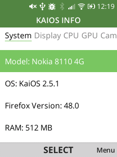

# KaiOS Info
## Screenshots

See more in [./docs](./docs/)
## Description

KaiOS Info utilizes a variety of Mozilla's and KaiOS' APIs, along with some JavaScript APIs, to gather comprehensive device data. It offers the following tabs:

- System (Model, OS, Firefox Version, RAM, Developer Mode Status)
- Display (Resolution, Depth, Aspect Ratio, Orientation)
- CPU (Cores Amount, Frequency)
- GPU (Model, Manufacturer)
- Camera (Id, Name, Photo Resolution, Focal Length, Video Resolution, Bitrate, Frametime, Codec)
- Battery (Level, Health, Status, Temperature)
- Wi-Fi (Type, SSID, Speed, Signal Strength, IP Address, Frequency, Internet Access, Hidden SSID)
- Network (Type, Provider, Standard, Signal Strength, Roaming Status, Status, ICCID)
- Bluetooth (Status, Bluetooth Name, Address, Discoverable Status and Discovering Status)
- Storage (Type, Total Space, Space Used, Default Status)
- About KaiOS Info

It also has a tab with all the details, examples and sources of the APIs used.

The program has been tested on Nokia 8110 4G with KaiOS 2.5.1.

## Notes

- Certain tabs such as Battery, Wi-Fi, Network, Bluetooth, and Storage auto-refresh the data every second, which can be toggled in the Menu.
- The program estimates CPU frequency since there is no API available for this purpose.
- To enable or disable debug output, press the "#" key once.

## How to install

- Use [Bananahackers guide](https://wiki.bananahackers.net/development/webide) on how to install applications ([Old Wiki guide](https://ivan-hc.github.io/bananahackers/install-omnisd.html#h.p_9Fk5jizGWpwi)) 
